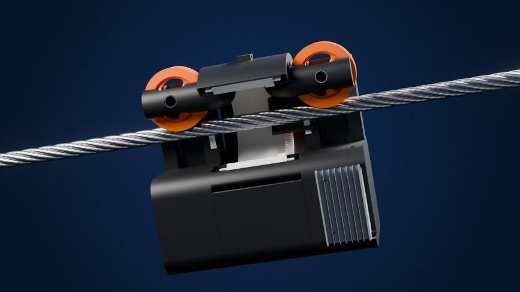
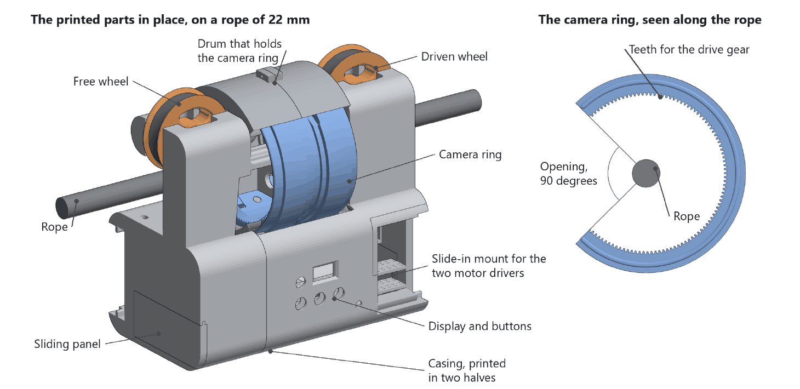
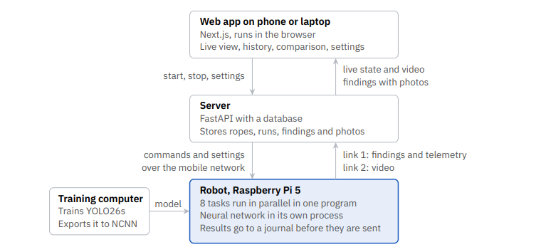
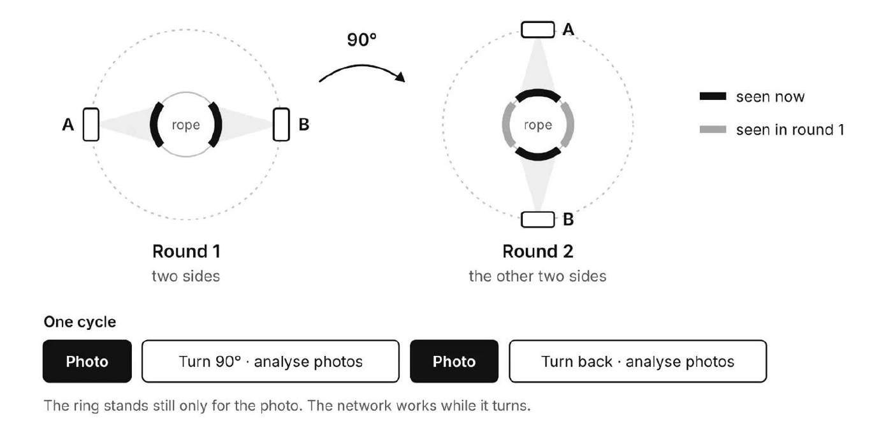
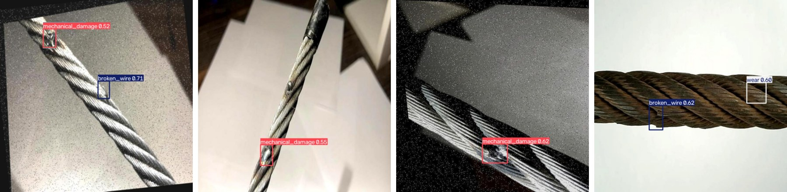
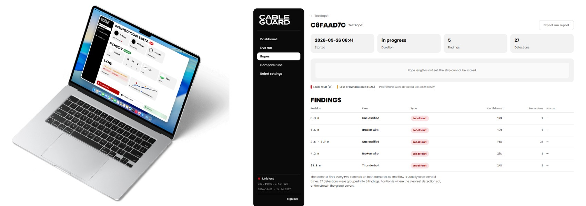

# Cableguard

**Guarding the lifelines of the Alps.** An autonomous robot that inspects steel wire ropes.



**Figure 1.** Cableguard on a rope, rendered from our CAD model.

The operator places Cableguard on the rope and presses start, and the robot works alone. Two
cameras on a rotating ring photograph all four sides of the rope, a YOLO26 network that we
trained on about 22,000 rope images marks eight classes of damage, and the steps of the motor
give the position of every photo. A web app shows the inspection live and compares it with
earlier ones.

We are Kirchenfeldrobotics, a student robotics club from Bern, and we built Cableguard for the
World Robot Olympiad 2026 (Future Innovators, Senior). This README describes how the robot is
built, how its software works and how to run it. The whole story is in our
[project report](documents/CableGuard_Report%20_Kirchenfeldrobotics.pdf), and the
[movie](documents/CableGuard_Movie_Kirchenfeldrobotics.mp4) shows the robot.

## The problem

A steel rope does not fail suddenly. Wires break, corrosion and lightning leave marks, and the
rope weakens over years. On 23 May 2021 the haul rope of the Stresa–Mottarone cable car in
Italy snapped and fourteen people died. Court experts later found that 68 % of the wires at the
break had failed from fatigue and corrosion long before that day.

Switzerland has about 2,450 cableways, and every second small cableway has financial problems.
Today a person checks a rope by riding on a slow-moving gondola, which is slow, expensive and
prone to error. A magnetic test by a testing body happens only every few years. Cableguard
works in the gap between two tests. It photographs the whole rope as often as the operator
wants, and damage that grows slowly shows up as a change between two runs.

Cableguard sees the surface of the rope. It adds to the magnetic test by an accredited body and
never replaces it.

## The robot in numbers

| Property | Value |
| --- | --- |
| Size of the casing | 277 x 160 x 245 mm |
| Weight | 3 kg |
| Test rope | Steel rope, 22 mm diameter, 1.6 m long |
| Scan speed | About 3 cm per second, about 110 m per hour |
| Power | 3S LiPo battery, 11.1 V nominal |
| Computer | Raspberry Pi 5 |
| Motors | 2 x NEMA 23 stepper motor, each with a TB6600 driver |
| Cameras | 2 x Raspberry Pi Camera Module 3 Wide with LED light |
| Network | YOLO26s, 9.5 million parameters, eight classes of damage |
| Parts of one robot | About CHF 400 |

## Mechanics

The body of the robot hangs below the rope. Two wheels on top carry it, and the rope passes
through the upper part of the casing, where a ring with the two cameras surrounds it (Figure 2).



**Figure 2.** The printed parts of the robot and the camera ring, drawn from our CAD model.
Motors, belt, cameras and electronics are not shown.

### Drive

The robot rides on two wheels. A NEMA 23 stepper motor drives one of them through a GT2 belt
with a printed tensioner, and the second wheel runs free. The first wheels were printed from PLA
and slipped on the steel. The current wheels have an insert of flexible TPU with a V-shaped
groove. The weight of the robot presses the rope into the V, and this wedge gives the grip that
a flat wheel does not have.

We chose a stepper motor because it moves in fixed steps, 200 per turn, each split into 8
microsteps by the driver. The robot counts every microstep it sends, so it knows its position
without an extra sensor. The weakness of counting steps is slip: if the wheel slips, the robot
believes it is further along the rope than it is. We have not measured slip yet.

### Why a camera ring

A rope is round, and one camera sees less than half of it. The testing institutes therefore
mount four cameras around the rope. We wanted the same coverage with fewer parts. The Raspberry
Pi 5 has two camera connectors, and every further camera adds a cable, weight and a picture for
the network to process. So two cameras sit opposite each other on a ring, and a second NEMA 23
turns the ring through a printed gear.

The ring has an opening of 90 degrees. To put the robot on a rope, the ring turns to its open
position, the rope slips through the opening into the centre of the ring and the wheels come to
rest on the rope. Two rules follow from the hardware. The ring always swings back the way it
came, because the cameras hang on their cables and a ring that kept turning would wind them up.
And since the ring has no end switch, whoever sets up the robot leaves it at its parking angle
and the software counts every step from there.

### Casing and material

Every structural part is 3D printed in PLA: both halves of the casing, the drum that holds the
camera ring, the wheel hubs and all mounts, 16 pieces in total. Only the axles, spacers, screws
and belts are bought parts. We print because we can redesign a part ourselves and test it a day
later, without a workshop.

The casing is a prototype. It encloses the electronics, but it has no seals, and we have not
tested it in rain or frost yet. The files to print are in [`3d-model/print/stl`](3d-model/print/stl),
the CAD files in [`3d-model/cad/step`](3d-model/cad/step) and the list of all parts in
[`3d-model/BOM.md`](3d-model/BOM.md).

## Electronics

One Raspberry Pi 5 runs everything on the robot: both motors, both cameras, the neural network
and the connection to the server.

| Component | Part | Connected to |
| --- | --- | --- |
| Computer | Raspberry Pi 5 | |
| Drive motor | NEMA 23 stepper motor with TB6600 driver | Step GPIO 18 (pin 12), direction GPIO 23 (pin 16) |
| Ring motor | NEMA 23 stepper motor with TB6600 driver | Step GPIO 12 (pin 32), direction GPIO 16 (pin 36) |
| Cameras | 2 x Raspberry Pi Camera Module 3 Wide with LED light | Both camera ports of the Pi |
| Distance sensor | TOF200C (VL53L0X laser sensor) | I2C bus 1, SDA on pin 3, SCL on pin 5 |
| Display | 0.96 inch OLED (SSD1306), 128 x 64 pixels | I2C bus 1, address 0x3C |
| Buttons | Red start button, white stop button. A third button is wired and has no function yet | GPIO 5 (pin 29) and GPIO 6 (pin 31), each switched to ground |
| Buzzer | | GPIO 26 (pin 37) |
| Mobile link | LTE module with SIM card | |
| Power | 3S LiPo battery (11.1 V nominal) and step-down converter | Battery voltage directly to the motor drivers, 5 V from the converter to the Pi |

Three decisions shaped the wiring.

**One computer.** A neural network needs a real processor, and the Pi 5 has the two camera
ports and the GPIO pins we need. A photo, the motor position at that moment and the result of
the network now live in one program, and nothing has to be synchronised over a cable.

**Usable without a phone.** Two buttons, a buzzer and a small display are enough to start a
run, stop it and see what the robot is doing. A button sends the same command as the web app,
so both always do the same thing. Each state has its own sound, and the display shows connection,
position and speed. The Pi pulls both button pins high from the moment it boots, so a button
held down during start-up cannot start the motor.

**Cables that explain themselves.** Three voltage levels, 12 V, 5 V and 3.3 V, meet in a small
space. Every cable carries a three-digit label with two digits for the component and one for
the pin. 013 is pin 3 of the drive motor driver, its step input.
[`documents/cable_label.md`](documents/cable_label.md) lists the labels and
[`documents/pins.md`](documents/pins.md) maps every label to a pin of the Pi.

## Software

The software runs on three devices. The robot inspects on its own, the server stores every
finding and the web app is the window for the operator (Figure 3). We wrote in Python,
TypeScript and C. Everything else we use is open source: FastAPI, Next.js, Ultralytics YOLO,
NCNN and the Raspberry Pi libraries for the cameras and the PIO block.



**Figure 3.** Software architecture: three devices and two links from the robot to the server.

### One scan cycle

1. Both cameras take a photo while the ring stands still.
2. The ring swings 90 degrees. During the swing the network analyses the two photos.
3. Both cameras take a second photo of the two sides that were hidden.
4. The ring swings back and the network analyses the second pair.
5. Every result is written to a journal with the position of the robot at the moment of the
   photo.

Only the shutter needs a ring that stands still. The network can work while the cameras move,
so turning and analysing happen at the same time (Figure 4).



**Figure 4.** Scan cycle of the camera ring: two rounds of photos and one quarter turn.

Each camera delivers two pictures at once, 640 x 640 pixels for the network and 640 x 480 for
the live view. The scan cycle is one of nine tasks that run in parallel in one program
([`robot/src/app/main.py`](robot/src/app/main.py)).

| Task | What it does |
| --- | --- |
| Control link | Holds the connection for commands and results, sends the journal and a heartbeat every 5 seconds |
| Video link | Sends the newest picture of each camera |
| Frame stream | Takes the small picture of both cameras for the live view |
| Detection | The scan cycle: photos, quarter turns, network, reports |
| Guard | Stops the drive when the connection is lost while driving |
| Telemetry | Reports speed, position and state twice a second |
| Distance | Reads the distance sensor and watches for a rope socket |
| Display | Redraws the display |
| Update | Runs the update script when the operator asks for it |

### The robot sets its own speed

In the first weeks the operator chose the speed in the web app. A robot that drives faster than
its network can analyse leaves stripes of rope that nobody looks at, so now the robot measures
itself. At every start it runs nine test cycles and times the cameras and the network
separately. One photo covers a length *L* of rope, and the robot may travel exactly *L* per
cycle.

| What the robot calculates | Formula |
| --- | --- |
| Time for one quarter turn | `t_turn = max(H · D / R, t_ring)` |
| Time for one cycle | `T = R · (C / R + t_turn)` |
| Driving speed | `v = L / T` |

*C* is the camera time and *D* the network time of one cycle, *R* = 2 the number of photo
rounds and `t_ring` the fastest quarter turn of the ring. *H* = 1.5 is a safety factor, because
the network needs longer for a photo with damage than for the clean rope it was timed on. An
example: with *L* = 60 mm, *C* = 0.14 s and *D* = 1.2 s, which is 0.3 s per photo, the cycle
takes *T* = 1.94 s and the robot drives 31 mm per second, about 110 m per hour. The operator
only chooses start, stop and the direction.

The network sets the pace, and two parts can limit it. If the ring cannot swing a quarter turn
in the time the network needs, it takes the time it needs and the whole cycle grows around it.
And the speed stays inside the limits of the drive: a drive that cannot go slowly enough leaves
a gap between two photos, and the robot writes a warning to its log. The code is in
[`robot/src/vision/pacing.py`](robot/src/vision/pacing.py).

### Knowing the position

A finding is only useful with its position, and the position is the count of motor steps. Every
pulse has to arrive on time, also while the processor is busy with the network. Our first driver
made the pulses in Python, and the motor stuttered whenever the network ran.

The Raspberry Pi 5 contains a hardware block called PIO, four small state machines that run
independently of the processor. We wrote a program of seven instructions for it and a small C
library around it. The software hands the hardware a block of pulses, and the hardware plays it
with a resolution of one microsecond. The robot adds a block to its position only after the
hardware reports it as played, so the count cannot run ahead of the motor.

```
.side_set 1 opt
.wrap_target
    pull block      side 0       ; wait for a block, STEP stays low
    out x, 16                    ; x = steps - 1, OSR keeps the low-time count
step:
    mov y, osr      side 1 [7]   ; STEP high for 10 cycles
    nop                    [1]
low:
    jmp y-- low     side 0       ; STEP low for y + 1 cycles
    jmp x-- step
    push noblock                 ; block done
.wrap
```

The complete program of the PIO block for one stepper motor, from
[`robot/src/motion/stepgen.c`](robot/src/motion/stepgen.c).

Both motors use the same program, one state machine each. A block is one word: the number of
steps and the pause between them. While the robot drives, a thread feeds the hardware blocks of
20 milliseconds and keeps three of them queued. That is enough for a moment in which the
processor is busy, and few enough that a stop command does not wait behind a long queue.

### The neural network

We use YOLO26s, an object detector with 9.5 million parameters that was released in January
2026 for small computers without a graphics card. It draws a box around every damage and gives
a score of how sure it is.

For training we merged two public collections of rope photos with a script that unifies their
class lists. The merged set has about 22,000 images with 37,513 marked damages in eight classes.
We trained for 150 rounds on a graphics card and converted the result to NCNN, a format that
runs fast on the ARM processor of the Pi. On the validation photos, which were not used for
training, the network finds 96 % of all marked damages, and 74 % of its boxes are real damages.

| Class | AP50 | Marked damages in the data | Reported as |
| --- | --- | --- | --- |
| `wear` | 0.95 | 11,547 | Loss of metallic area |
| `kink` | 0.92 | 346 | Local fault |
| `bird_caging` | 0.87 | 488 | Local fault |
| `unknown_defect` | 0.72 | 580 | Local fault |
| `broken_wire` | 0.69 | 10,054 | Local fault |
| `mechanical_damage` | 0.55 | 3,326 | Local fault |
| `thunderbolt` | 0.48 | 4,025 | Local fault |
| `break` | 0.28 | 7,147 | Local fault |

Average precision per damage class at IoU 0.5 on the validation set, first training run on 13
September 2026. The mean is 0.68.

Two decisions follow from these numbers. The robot reports a box as soon as the network is 10 %
sure. A false alarm costs the operator one look at a photo, and a missed broken wire can cost
much more. And it reports each damage in the two groups that rope inspectors know, local fault
(LF) and loss of metallic area (LMA). The table shows why that helps. The network confuses
`break` with `broken_wire` and `thunderbolt` with `mechanical_damage`, because the two photo
collections use different names for the same damage. All four are local faults, so the report of
the robot stays correct.



**Figure 5.** Four photos from the public test set with the boxes and confidence values of our
network.

The network runs as a separate program. NCNN holds the lock of the Python interpreter for a
whole analysis, so before that change every analysis froze the whole robot for a few hundred
milliseconds, including the thread that feeds the motor
([`robot/src/vision/detector.py`](robot/src/vision/detector.py)).

These numbers come from photos of other people's ropes. On our own test rope the detection
works well in our runs, but we have not yet counted hits and misses on prepared damage.

### Passing a rope socket

A rope ends in a thick metal fitting, the rope socket, and the camera ring cannot turn past it.
A laser distance sensor looks ahead. While the robot still stands it averages ten readings to
learn what the sensor normally sees. When something appears 10 cm nearer than that, the ring
parks at the one angle that leaves room for the socket and the network pauses. 50 cm after the
last sighting the ring closes and the scan continues. A tower is passed the same way.

The sensor compares with its own calibration and not with a fixed distance, because where the
beam lands depends on how the sensor sits and which rope it is. Two things can open the robot.
An opening by the sensor ends once the robot has driven clear. An opening the operator asked
for in the web app ends only when the operator closes it.

### Two links to the server

The robot keeps two connections to the server, one for commands and results and one for video,
so a video frame cannot delay a stop command. Both are WebSockets, and the robot signs in with
a token.

Every result is written to a journal on the memory card before it is sent, and after a
connection loss the robot continues at the byte where it stopped. If the connection breaks
while the robot drives, it stops and sounds the fault signal, because nobody could stop it
remotely.

Robot and server read their messages from the same file,
[`shared/comm_protocols/messages.py`](shared/comm_protocols/messages.py), so both sides always
speak the same protocol.

| Message | Direction | What it carries |
| --- | --- | --- |
| `alive` | Robot to server | Heartbeat every 5 seconds |
| `motion_telemetry` | Robot to server | Speed and position in microsteps and in metres, the scan speed the robot chose, whether it is open, the versions of the settings and of the software it runs on |
| `distance_telemetry` | Robot to server | Reading of the distance sensor |
| `vision_telemetry` | Robot to server | One per photo: boxes, class and confidence, position, and the photo itself if something was found |
| `defect` | Robot to server | A finding from a second sensor, kept for the magnetic head |
| `start`, `stop` | Server to robot | Drive in a direction, stop |
| `reset_origin` | Server to robot | Count the position from here, sent when a run is selected |
| `open`, `close`, `socket_watch` | Server to robot | Open or close the ring, arm the distance sensor |
| `settings` | Server to robot | The whole set of settings with a version number |
| `update` | Server to robot | Run the update script |

Telemetry is sent live, because a reading is worth nothing a second later. Photos with findings
go through the journal, because a detection that is not stored is a damage lost. Neither side
confirms a command. The robot reports its state in the telemetry, and the web app shows a
command as carried out only when the telemetry says so.

### Server and web app

The server is a FastAPI program with a database, SQLite by default. It stores ropes, runs,
findings and the photo every finding was made in. A finding belongs to a run, so the server
drops findings while no run is selected. When the operator selects a run, the server tells the
robot to count its position from zero.

The web app shows both camera streams, position and speed live, keeps every inspection of a
rope and compares two of them. One damage is usually photographed several times, so the web app
groups detections of the same type that are less than 0.5 m apart into one finding. In a
comparison, findings less than 1.5 m apart count as the same damage, so the operator sees what
is new and what has disappeared. Every run can be exported as a PDF. Operators log in with a
password or by holding their phone to an NFC tag on the robot.



**Figure 6.** The web app: the dashboard on a laptop and the findings of one run with position,
flaw and confidence.

**Settings.** The robot has 31 settings in seven groups, from the microstepping of the drive to
the exposure of the cameras. They are defined once, in
[`shared/comm_protocols/settings.py`](shared/comm_protocols/settings.py), with their limits and
their explanation. The server stores the values of the operator, and the settings page draws
itself from that list, so a new setting is added in one place. The robot boots on its own
defaults and runs without a server.

**Update.** The settings page can also update the robot. The robot then runs the update script
that sits beside the repository on the Pi, which pulls the latest software and restarts the
program. The page shows the commit the robot runs on, so the operator sees that the update
worked ([`robot/src/app/update.py`](robot/src/app/update.py)).

The web app has its own [README](webapp/README.md) with every route and endpoint, and
[DESIGN.md](webapp/DESIGN.md) describes its design.

### What the robot decides by itself

| Decision | What it is based on |
| --- | --- |
| Driving speed | Its own timing test at start-up |
| Speed of the ring | The time the network needs for one pair of photos |
| Open and close for a rope socket or a tower | Distance sensor compared with its own calibration |
| Pause the network | Standing still, which keeps the processor cool |
| Stop | Connection lost while driving |
| Accept new settings | Only when the drive stands and the ring is parked |

## Repository

| Folder | Content |
| --- | --- |
| [`robot/`](robot) | The program on the Raspberry Pi: main program in `app/`, stepper drivers and PIO program in `motion/`, cameras in `camera/`, network and speed in `vision/`, distance sensor in `tof/`, display in `display/`, the two links in `link/` |
| [`backend/`](backend) | The server: routes, database and the hub that passes messages between robot and web app |
| [`webapp/`](webapp) | The web app |
| [`shared/`](shared) | Messages and settings, used by robot and server |
| [`wirerope-training/`](wirerope-training) | Merges the photo collections, trains the network and exports it for the robot |
| [`scripts/`](scripts) | `deploy-model.sh` copies the exported network to the Pi |
| [`3d-model/`](3d-model) | Files to print, CAD files and the list of parts |
| [`documents/`](documents) | Project report, movie, pin and cable legends |

## Getting started

### Server

```bash
cd backend
pip install -r requirements.txt
export CABLEGUARD_ROBOT_TOKEN=<a long random string>
uvicorn app.main:app --port 8021
```

| Variable | What it is for |
| --- | --- |
| `CABLEGUARD_ROBOT_TOKEN` | The token the robot signs in with. Required, and it has to be set in the environment |
| `DEFAULT_USERNAME`, `DEFAULT_PASSWORD` | The operator account, created at the first start |
| `JWT_SECRET` | Signs the logins. Without it every restart logs the operator out |
| `CORS_ORIGINS` | Address of the web app, if it is not served from the same address as the server |
| `DATABASE_URL` | Where the database is. By default a SQLite file in `backend/data/` |
| `NFC_LOGIN_KEY` | The key on the NFC tag. Empty switches the NFC login off |

All but the first can also stand in `backend/.env`. Be careful with data you want to keep: when
`SCHEMA_VERSION` in [`backend/app/database.py`](backend/app/database.py) changes, the server
drops the database and builds it again.

### Web app

```bash
cd webapp
npm install
cp .env.example .env.local    # NEXT_PUBLIC_API_URL points at the server
npm run dev                   # http://localhost:3000
```

### Robot

The robot needs a Raspberry Pi 5 with Raspberry Pi OS, both cameras connected and I2C switched
on. The cameras use `picamera2`, which is a system package of Raspberry Pi OS
(`python3-picamera2`) and therefore not in `requirements.txt`.

```bash
cd robot
pip install -r requirements.txt

# the C library for the PIO block, needs libpio-dev
cd src/motion
gcc -O2 -shared -fPIC -I/usr/include/piolib -o libstepgen.so stepgen.c -lpio -pthread
```

The network is not in the repository, because the code travels over git and the model over
ssh. Export it on the training computer and copy it to the Pi:

```bash
cd wirerope-training
python export_for_robot.py --weights weights/best.pt    # writes robot/models/best_ncnn_model
cd ..
./scripts/deploy-model.sh pi@cableguard.local
```

Then start the program:

```bash
export CABLEGUARD_WS_URL=wss://<server>/api/ws/robot
export CABLEGUARD_VID_WS_URL=wss://<server>/api/ws/video/robot
export CABLEGUARD_ROBOT_TOKEN=<the same token as on the server>

cd robot/src
python -m app.main
```

The robot loads the network, runs its test cycles and sounds two short rising tones when it is
ready. A run on our test rig then looks like this. We turn the camera ring to its open
position, hang the robot on the rope, select a run in the web app and press the red button. The
robot starts to drive, the ring swings back and forth, and both camera pictures appear live in
the web app together with the position. The white button stops the run.

On our robot the program runs as a systemd service, and the update script beside the repository
pulls the software and restarts it.

### Training the network

[`wirerope-training/tutorial-how-to-use.md`](wirerope-training/tutorial-how-to-use.md) describes
every step: download the two photo collections, merge them with `prepare_wirerope.py`, train in
the notebook and export with `export_for_robot.py`. The detector can be tested alone on a
laptop with a webcam:

```bash
python robot/src/vision/detector.py cam
```

### Testing the links

Two scripts test the connection to the server, one from the side of the robot and one from the
side of the browser. Both take `local` or `remote`, and the first needs
`CABLEGUARD_ROBOT_TOKEN`.

```bash
cd backend
python tests/robot_websocket_test.py local
python tests/ui_websocket_test.py local
```

## Challenges and tests

Six problems shaped the current design.

| Problem | What we saw | What we changed |
| --- | --- | --- |
| Wheels slip | Printed PLA wheels slipped on the steel rope | TPU insert with a V-shaped groove that the rope is pressed into |
| Motor stutters | Pulses from Python came late whenever the network ran | Pulses from the PIO hardware block |
| Network freezes the robot | Every analysis blocked all other threads | Network in its own process |
| Rope is skipped | The operator could drive faster than the network could analyse | The robot sets its own speed |
| Photos unusable | Automatic exposure changed the brightness, the focus was wrong | Fixed exposure, gain and white balance, focus locked at 5 cm |
| Position jumps | New drive settings during a ramp changed the meaning of counted steps | Settings apply only while the robot stands |

We test on our own rig, a steel rope of 22 mm diameter and 1.6 m length. There we run complete
inspections: start by button, scan with the swinging ring, findings in the web app, stop.

What is still missing are measurements. We have not yet measured the position error over
distance, the hits and misses on prepared damage, the battery runtime, the steepest slope the
robot can climb or the behaviour in rain and frost, and we have no automated software tests.

Two estimates we will check first. Our test rope is level, but many small cableways are steep.
On a slope of 30 degrees the driven wheel has to pull about 15 N, while only about half of the
weight presses it onto the rope. The battery is the second question. The Pi 5 needs about 7 W
while the network runs, and two NEMA 23 motors on TB6600 drivers can need 10 to 20 W each, also
while they hold still. With 30 to 45 W, a 3S battery of 5,000 mAh would last only one to two
hours.

## Next steps

The prototype works on our test rig. Five steps separate it from a robot that an operator can
use.

1. **Real numbers and better eyes.** We count hits, misses and false alarms on a rope with
   prepared damage. Then we merge the twin classes of the two photo collections and retrain the
   network with photos from our own cameras.
2. **More speed.** At about 110 m per hour a long rope takes more than one night. The network
   sets the speed, so we will test a smaller network, an AI accelerator for the Raspberry Pi and
   a longer photo.
3. **Ready for weather.** A casing of ASA or aluminium with sealed openings, tested in rain and
   frost, and a catch that holds the robot if a wheel leaves the rope.
4. **Inside the rope.** We have a ring of eight Hall sensors from an earlier version, and the
   software already has a message for a second sensor. Missing are the magnets in a yoke
   machined from iron, a safe way to put this head on the rope and a field model that turns the
   readings into findings.
5. **A report an inspector can file.** The web app already exports a run as a PDF with every
   finding, its photo and its position. Missing are a rating of the severity and a clear
   statement of what was not inspected.

## Team

| Member | Responsibility | In this project |
| --- | --- | --- |
| Jakob Gutersohn | Hardware | Designed every custom part in CAD, assembled the robot and soldered |
| Nils Buchli | Software and electronics | Robot software on the Raspberry Pi and the server. Set up and tested the electronics with Valéry |
| Valéry Piot | Software and electronics | Web app, login, the network with its training and parts of the Raspberry Pi. Wired all components and set up and tested the electronics with Nils |
| David Bänziger | Coach | Helped us plan and organise and reviewed our work |

We are in the third year of Gymnasium Kirchenfeld in Bern, and Kirchenfeldrobotics is a
registered association ([kirchenfeldrobotics.ch](https://kirchenfeldrobotics.ch)).

We want Cableguard to outlive this competition: a robot on every historic ropeway, and every
broken wire found on the day it breaks, not on the day the rope fails.
